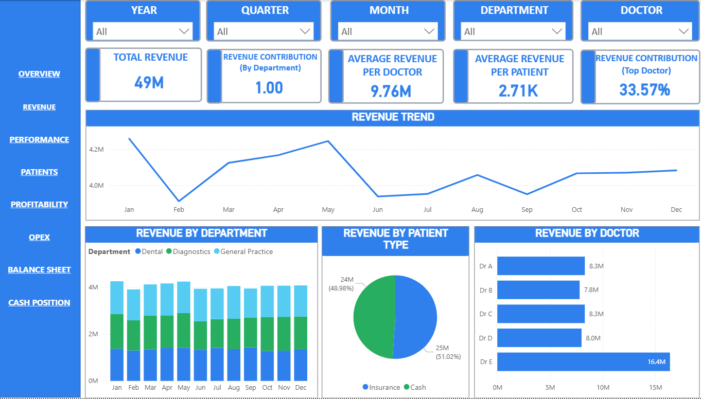

# Clinic Financial Performance Dashboard

## Overview

This project is an executive-level healthcare business intelligence solution developed in Power BI to provide centralized visibility into clinic financial performance, operational efficiency, patient analytics, profitability, and cash flow management.

The dashboard consolidates financial and operational healthcare data into a comprehensive reporting system designed to support leadership decision-making across revenue performance, patient behavior, departmental efficiency, profitability analysis, and balance sheet monitoring.

The objective of this project was to transform fragmented clinic reporting into an interactive and executive-focused analytics platform that enables faster, smarter, and more data-driven healthcare management.

---

# Business Problem

Healthcare organizations often face challenges such as:

- fragmented operational and financial reporting
- limited visibility into clinic profitability
- difficulty tracking patient trends
- lack of centralized KPI monitoring
- delayed financial performance insights
- limited cash flow visibility
- disconnected balance sheet reporting
- inefficient departmental performance tracking

This dashboard was developed to solve these challenges through centralized and interactive healthcare analytics.

---

# Project Objectives

The dashboard was designed to help management:

- monitor clinic financial performance
- analyze revenue and profitability trends
- track patient growth and retention
- monitor departmental efficiency
- improve operational visibility
- analyze balance sheet health
- monitor cash position and liquidity
- support executive healthcare decision-making

---

# Tools & Technologies Used

- Power BI
- Power Query
- DAX Measures
- Microsoft Excel
- Financial Analytics
- Healthcare KPI Reporting
- Executive Dashboard Design
- Interactive Dashboard Filters
- Business Intelligence Reporting
- Operational Analytics
- Profitability Analysis
- Cash Flow Analytics

---

# Data Source

### Source Type:
Microsoft Excel

### Data Includes:

- Patient Transactions
- Revenue Data
- Operational Expenses
- Department Performance
- Profitability Metrics
- Balance Sheet Information
- Cash Position Data
- Patient Analytics
- Healthcare KPI Metrics
- Financial Performance Data

---

# Dashboard Modules

## Overview Dashboard

Provides a high-level summary of:

- total revenue
- EBITDA performance
- patient growth
- profitability trends
- operational KPIs
- financial performance indicators
- clinic performance visibility


---

## Revenue Dashboard

Focused on:

- revenue trends
- revenue growth analysis
- department-wise revenue
- monthly revenue tracking
- revenue contribution analysis
- healthcare service performance



---

## Performance Dashboard

Focused on:

- operational efficiency
- clinic performance KPIs
- departmental performance
- service utilization analysis
- efficiency monitoring
- performance benchmarking


---

## Patients Dashboard

Focused on:

- patient growth trends
- repeat patient analysis
- patient segmentation
- patient retention metrics
- patient volume analysis
- patient behavior insights


---

## Profitability Dashboard

Focused on:

- EBITDA analysis
- gross profit trends
- net profitability
- department profitability
- margin analysis
- profitability performance tracking


---

## OPEX Dashboard

Focused on:

- operational expense analysis
- expense category tracking
- cost monitoring
- monthly OPEX trends
- cost efficiency analysis
- expense variance tracking


---

## Balance Sheet Dashboard

Focused on:

- assets analysis
- liabilities monitoring
- equity analysis
- working capital visibility
- financial position monitoring
- balance sheet health tracking


---

## Cash Position Dashboard

Focused on:

- cash flow visibility
- liquidity monitoring
- cash position tracking
- cash movement trends
- operational cash management
- financial stability monitoring


---

# Key KPIs Tracked

- Total Revenue
- EBITDA
- Gross Profit Margin %
- Net Profit Margin %
- Total Patients
- Repeat Patient %
- Revenue Growth %
- OPEX Ratio
- Department Performance
- Cash Position
- Working Capital
- Balance Sheet Ratios
- Monthly Growth Trends
- Operational Efficiency Metrics

---

# Key Insights Generated

- Improved visibility into clinic financial performance
- Enabled executive monitoring of operational efficiency
- Identified profitability trends across departments
- Enhanced patient analytics visibility
- Improved monitoring of healthcare revenue growth
- Strengthened cash flow and liquidity tracking
- Supported data-driven healthcare decision-making
- Centralized financial and operational reporting

---

# Repository Structure

```text
clinic-financial-performance-dashboard/
│
├── README.md
├── clinic-financial-performance-dashboard.pbix
├── clinic-dashboard-data.xlsx
│
├── screenshots/
│   ├── overview-dashboard.png
│   ├── revenue-dashboard.png
│   ├── performance-dashboard.png
│   ├── patients-dashboard.png
│   ├── profitability-dashboard.png
│   ├── opex-dashboard.png
│   ├── balance-sheet-dashboard.png
│   └── cash-position-dashboard.png
```

---

# Business Value Delivered

This dashboard helps healthcare leadership teams:

- improve operational visibility
- strengthen financial monitoring
- analyze profitability performance
- monitor patient behavior trends
- improve healthcare decision-making
- track clinic growth and efficiency
- centralize executive reporting
- improve financial planning and control

---

# About This Project

This project is part of my growing analytics portfolio focused on:

- Executive Business Intelligence
- Financial Analytics
- Healthcare Analytics
- KPI & Performance Reporting
- Business Performance Management
- Finance Transformation
- Operational Intelligence

Through Boardroom Insights, I aim to combine finance, strategy, and analytics into solutions that help businesses create clarity, visibility, and smarter decision-making.

---
